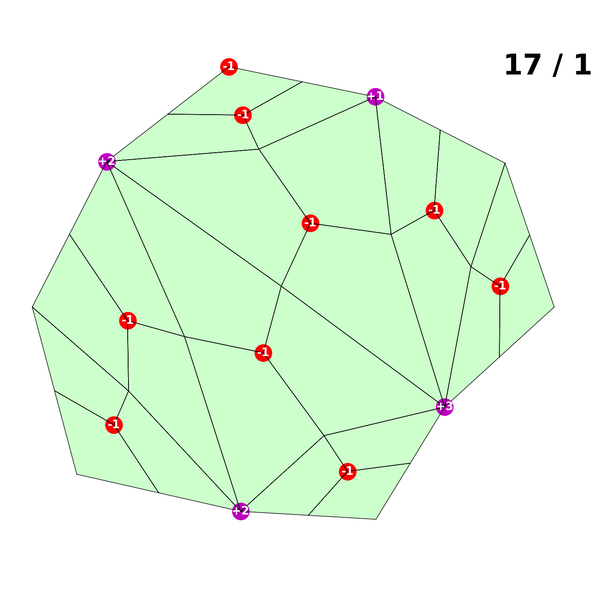
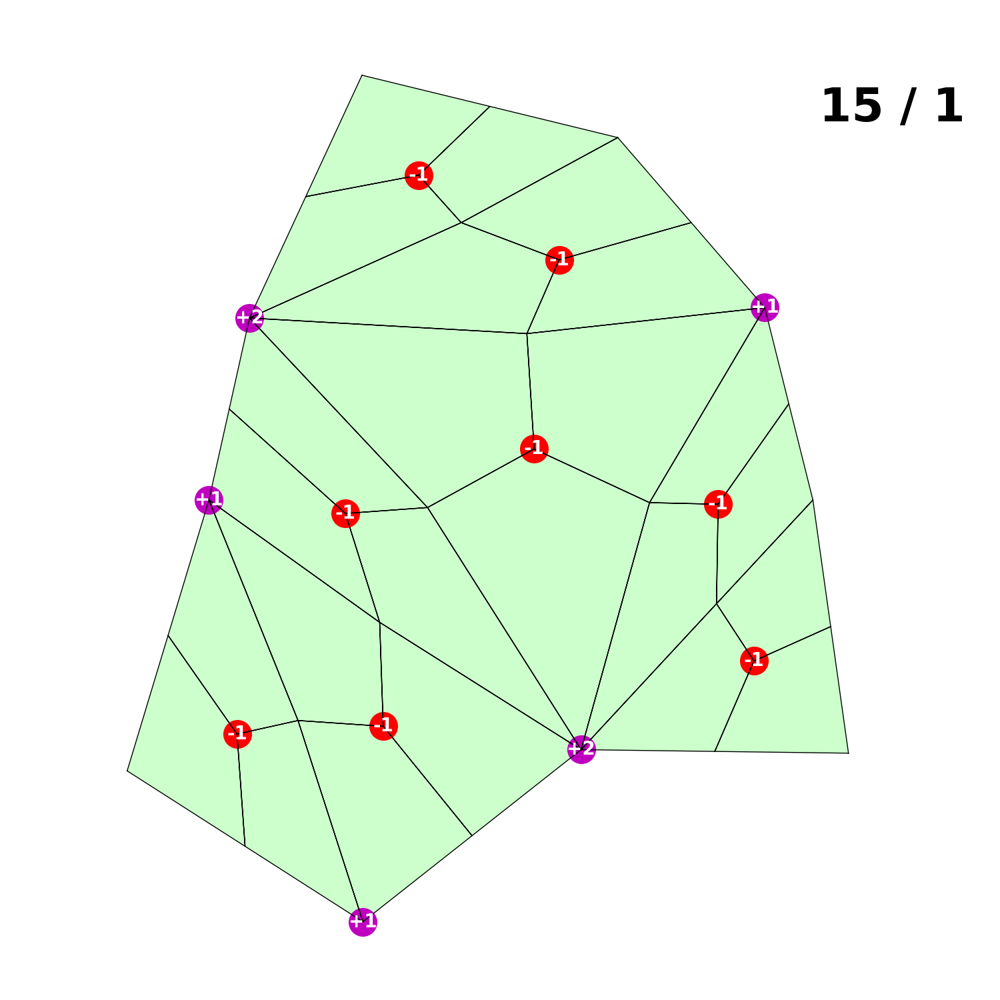

# Quadrl

Optimizing quadrilateral meshes with reinforcement learning.

## Setting up environment on Savio

Ensure that `JULIA_DEPOT_PATH` and `TMP` point to somewhere on your scratch folder otherwise you will get a system out-of-memory message.

```
export JULIA_DEPOT_PATH=/global/scratch/users/<user_name>/path/to/.julia
export TMP=/global/scratch/users/<user_name>/path/to/tmp
module load julia
```

## General installation

Clone this repository,

```
git clone https://github.com/ArjunNarayanan/Quadrl.git
```

Launch julia and instantiate the project. (Switch to `Pkg` mode using `]`.)

```julia
(@v1.8) pkg> activate .
  Activating project at `~/Research/Test/Quadrl`

(Quadrl) pkg> instantiate
```

This will instantiate the project and install all the dependencies.

## Using pre-trained models

First load the package,

```julia
using BSON
include("src/quad_game_utilities.jl")
include("random_polygon_environment.jl")
include("src/plot.jl)
```

We use abbreviations of package names to access package methods,

- `QM = QuadMeshGame`
- `PQ = PlotQuadMesh`
- `PPO = ProximalPolicyOptimization`

Create a random polygon environment using syntax `RandPolyEnv(polygon_degree, max_steps, quad_algorithm)`. `max_steps` is the maximum number of actions the policy can take before the environment terminates. `RandPolyEnv` is a wrapper around a `GameEnv` type provided by the `QuadMeshGame.jl` package.

```julia
wrapper = RandPolyEnv(10, 20, "catmull-clark")
PQ.plot_wrapper(wrapper)
```



Reset the environment to get a new random polygon mesh,

```julia
PPO.reset!(wrapper)
PQ.plot_wrapper(wrapper)
```



## Load pre-trained model

```julia
data_filename = "output/model-1/best_model.bson"
data = BSON.load(data_filename)[:data]
policy = data["policy"]
```

## Sample an action from the policy

```julia
state = PPO.state(wrapper)
action_probabilities = PPO.action_probabilities(policy, state)
action = rand(Categorical(action_probabilities))
```

Step the environment using the sampled action,

```julia
PPO.step!(wrapper, action)
PQ.plot_wrapper(wrapper)
```


Check if the environment is terminated,

```julia
julia> PPO.is_terminal(wrapper)
False
```

## Measuring performance

Since the policy is stochastic and the initial state is randomly generated, the performance of the policy must be estimated from playing it out multiple times. You can do this with the function `average_normalized_returns(policy, env, num_trajectories)` which returns the average returns and the standard deviation of the returns.

```julia
julia> average_normalized_returns(policy, wrapper, 100)
(0.953670634920635, 0.0755076983455874)
```

## Using other meshes

Here's how you can use a generic `QuadMeshGame` mesh object. (See that package for details on how to initialize a mesh.) Use the `FixedMeshEnv(mesh, desired_degree, max_actions)` method.

```julia
include("fixed_mesh_environment.jl")

mesh, desired_degree = initialize_random_mesh(10, "catmull-clark")
wrapper = FixedMeshEnv(mesh, desired_degree, 30)
```

When you `PPO.reset!(wrapper::FixedMeshEnv)` it is always reset to the same initial mesh. This way you can run the policy multiple times on the same mesh. So for example,

```julia
ret, dev = average_normalized_returns(policy, wrapper, 100)
```

gives the average score when running the policy on the same initial mesh `100` times.